# 1.**定制用户名**
首先使用 **hostnamectl** 查看原有用户名为 cuc-lab

输入 **sudo hostnamectl set-hostname clone-of-yzh** ，然后press enter

这时显示的还是之前的cuc-lab 

再查看一下hostname, 已经是修改后的名字了

重启一下虚拟机，发现已经是：

在Windows上使用ssh远程登录，得到结果：

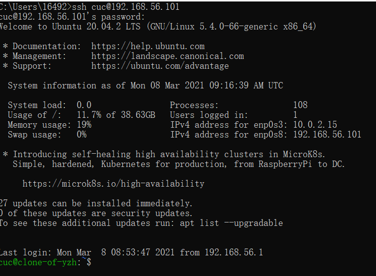

~~nice!~~

***

# 2.**无人值守iso的配置及安装**

## 2.1.配置一个无人值守安装iso

### 2.1.1.手动安装一个Ubuntu虚拟机

双网卡一开始就设置好，导入镜像以后几乎一直是done，其中有一个安装ssh服务器的选项选上就行。

很快 ~~（一整夜）~~ 就装好了

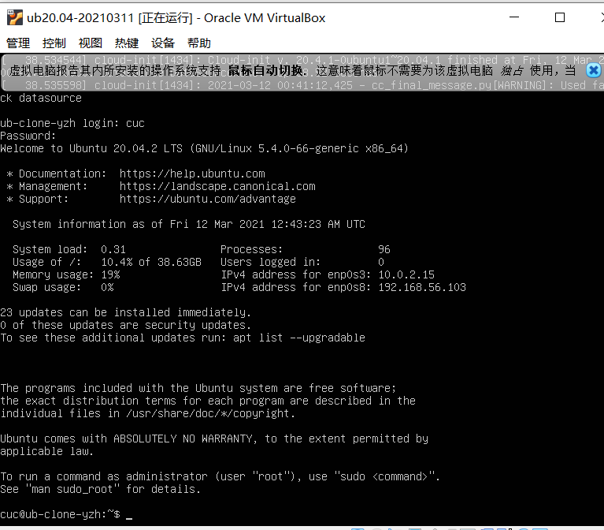

### 2.1.2.配置这个新安装的系统的iso镜像文件

找到新装好的虚拟机的自动配置描述文件：

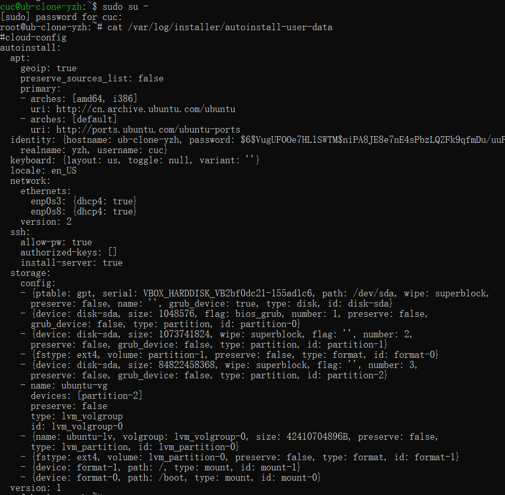

***

在宿主机上将这个文件下载到本地：

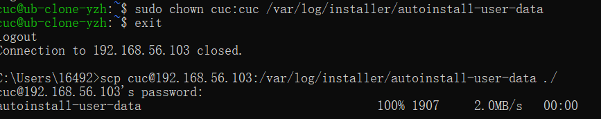

***

和老师的示例文件对比：

然而**cmd的fc命令**似乎不能像**MacOS的vimdiff**一样直接修改，最终还是拉了两个窗口手动修改了。~~不如直接用示例文件~~

改完以后再执行一次 **fc autoinstall-user-data user-data** 命令，比对发现除用户名外无差别。

接着我试图将这个 antoinstall-user-data 和 空文件meta-data 一起传回一个Ubuntu系统，好制作iso。~~Windows太惨了~~

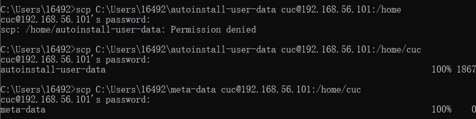

***

同时在Ubuntu系统中使用命令**sudo apt install genisoimage**装好genisoimage。

通过ssh远程连接到Ubuntu系统，在宿主机上执行**genisoimage -output init.iso -volid cidata -joliet -rock autoinstall-user-data meta-data**生成cloud-init镜像。

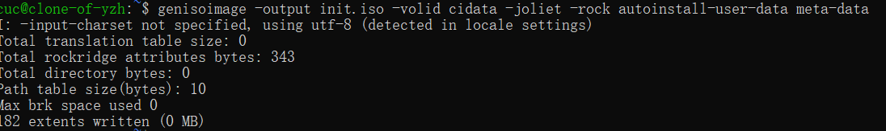

***

再将这个镜像传回Windows：

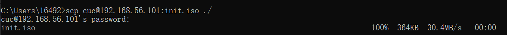

## 2.2.安装无人值守镜像

新建一个适用于无人值守安装的虚拟机，

移除「设置」-「存储」-「控制器：IDE」，

在「控制器：SATA」下新建 2 个虚拟光盘，分别挂载「纯净版 Ubuntu 安装镜像文件」和 init.iso，

并设置两张网卡。

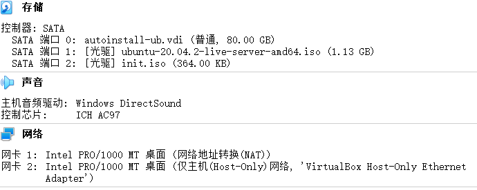

确认后启动。

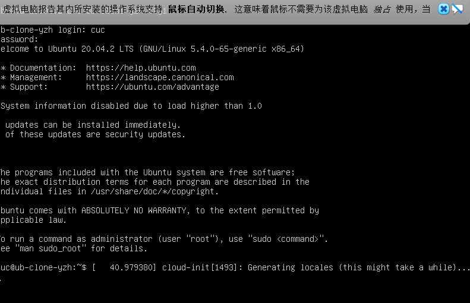

***

查看ip

192.168.56.108

ssh远程登陆成功

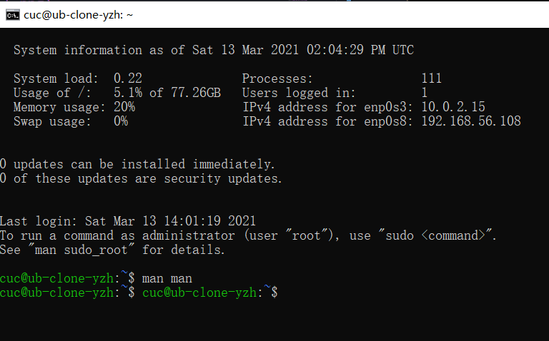

# 3.**关于ubuntu20.04添加新网卡后设置自动启用并获取ip**

任意添加一张网卡以后开机，输入ip a指令，

**enp0s9: <BROADCAST,MULTICAST> mtu 1500 qdisc noop state DOWN group default qlen 1000**

显然并未启用。

由于系统使用netplan管理网络，对于配置信息，使用vim打开文件

**sudo vim /etc/netplan/00-installer-config.yaml**

内容如下：

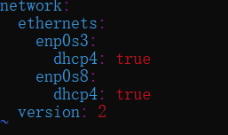

可以看到网卡enp0s3,enp0s8下面有参数dhcp4: true，说明该网卡开启了dhch地址分配，但是并没有出现enp0s9，所以手动加入enp0s9。

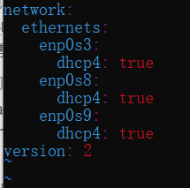

执行**sudo netplan apply**

再查看网卡情况：

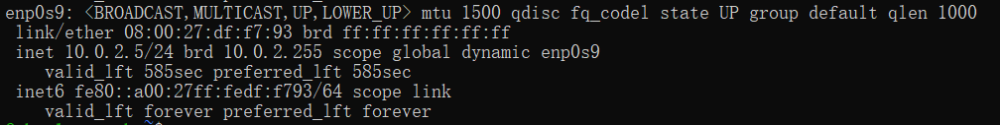

可以看到**state up** 和 **ip地址**

# 4.**使用sftp协议在宿主机和虚拟机之间传输文件**

sftp协议下，本地计算机连接虚拟机，并查看当前本地目录和虚拟机当前目录：

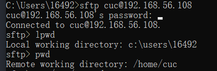

***

使用get命令将虚拟机中的文件下载到本地：

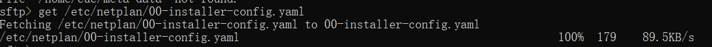

***

使用put命令将文件从本地上传到虚拟机：

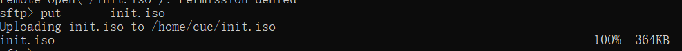

