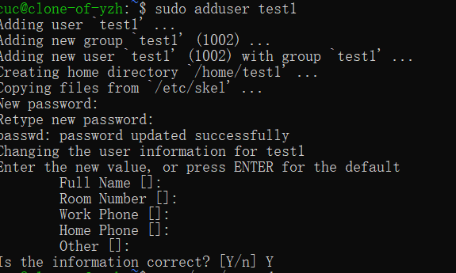
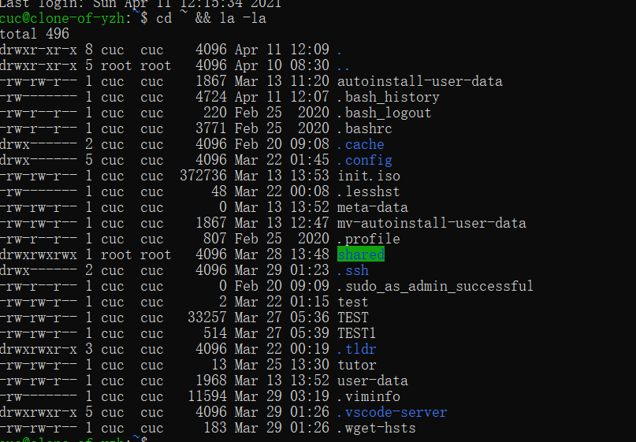

第一篇命令篇的url : https://asciinema.org/a/406310

第二篇实战篇的url : https://asciinema.org/a/406329

录屏主页 ：https://asciinema.org/~padresvater

## 自查清单：

### 如何添加一个用户并使其具备sudo执行程序的权限？



- 然后 ```sudo visudo``` 在root权限定义的那行下面补上一个新创立的用户test1，保存后退出；

- 使用```su test1```命令切换到新用户，测试```sudo ls```，发现能使用```sudo```

***

### 如何将一个用户添加到一个用户组？

```sudo usermod -a -G 1000 test1```

（1000为group的序号）

***

### 如何查看当前系统的分区表和文件系统详细信息？

- ```df```——文件系统详细信息，但df 命令只会列出已挂载的文件系统信息，但是对于没有挂载的文件系统是查看不到的。
  
- ```lsblk```命令是用来查看块设备的，可查看未挂载文件系统的分区。

- ```cat /proc/partitions```——分区表

***

### 如何实现开机自动挂载Virtualbox的共享目录分区？

- 首先需要生成一个备份，以便试验后回到正常状态
- 在虚拟机设置里的共享文件夹里新添加一个主机文件夹
- 打开虚拟机
- 接下来如 https://gist.github.com/estorgio/0c76e29c0439e683caca694f338d4003 所示进行操作
-最后查看家目录发现共享文件夹已经被高亮，说明挂载成功



***

### 基于LVM（逻辑分卷管理）的分区如何实现动态扩容和缩减容量？

- 动态扩容 

  ```lvresize --size -{{SIZE}} --resizefs {{volume_group}}/{{logical_volume}}``` 


- 动态缩减
  ```lvresize --size +{{SIZE}} --resizefs {{volume_group}}/{{logical_volume}}```

### 如何通过systemd设置实现在网络连通时运行一个指定脚本，在网络断开时运行另一个脚本？

- 修改```systemd-networkd.service```文件
- 先使用```locate systemd-networkd.service```找到该配置文件
- 路径为``` /etc/systemd/system/multi-user.target.wants/systemd-networkd.service```
- 修改为（只截取片段）
```
[Service]
...
ExecStart=<path_of_service1> start
ExecStop=<path_of_service2> stop
... 
```

### 如何通过systemd设置实现一个脚本在任何情况下被杀死之后会立即重新启动？实现杀不死？

- 该服务的配置文件修改为：
```
[Service]
...
Restart=always
...
```